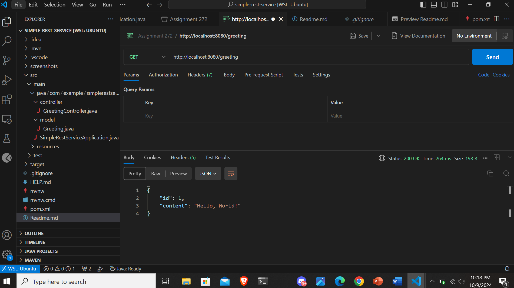
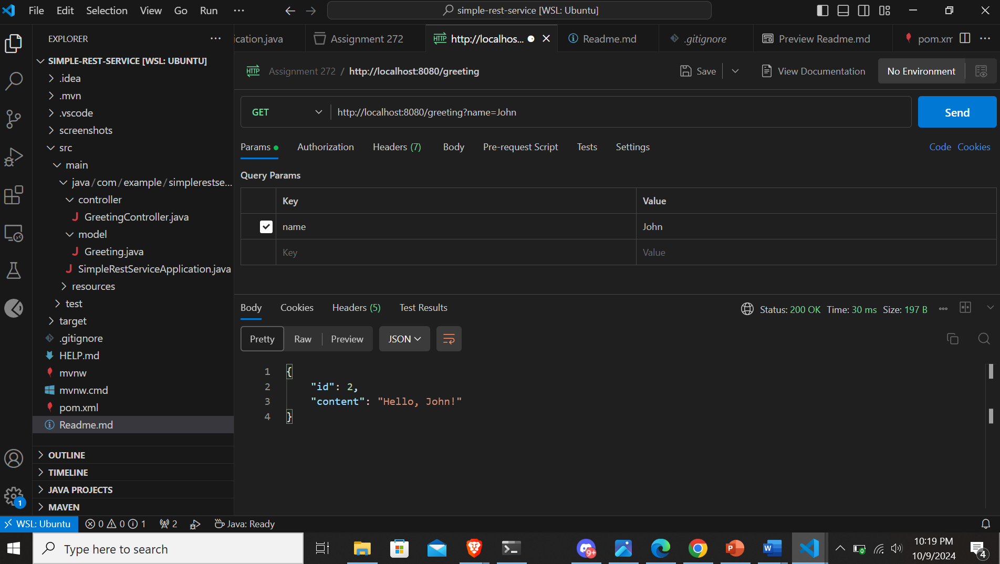

# Simple Rest Service Application using Java Spring Boot


## Project Setup and Execution Guide

## Prerequisites

Before running the application, ensure that you have the following installed:

1. **JDK 17** (Amazon Corretto recommended)
   - Install from the official Amazon Corretto documentation: [Download JDK 17](https://docs.aws.amazon.com/corretto/latest/corretto-17-ug/downloads-list.html)

2. **Maven**
   - On Ubuntu, you can install Maven using the following command:
     ```bash
     sudo apt install maven
     ```

3. **Postman** (or cURL)
   - Install Postman from [Postman Downloads](https://www.postman.com/downloads/)
   - Alternatively, you can install a VS Code plugin for Postman for testing API requests.

## How to Build

To fetch dependencies and build the project, run the following command:

```bash
mvn clean install
```

## How to Run the Application

After building the project, run the application using:

```bash
mvn spring-boot:run
```

By default, the application will start on port `8080`.

## How to Test the API

Once the application is running, you can use Postman or cURL to make GET requests to the following endpoint:

- **Without query parameter:**
  ```
  http://localhost:8080/greeting
  ```

- **With query parameter (`name`):**
  ```
  http://localhost:8080/greeting?name=YourName
  ```

This will return a greeting message from the application.

## Screenshots
### With no query parameter



### With query parameter John



### With query parameter Siddharth


